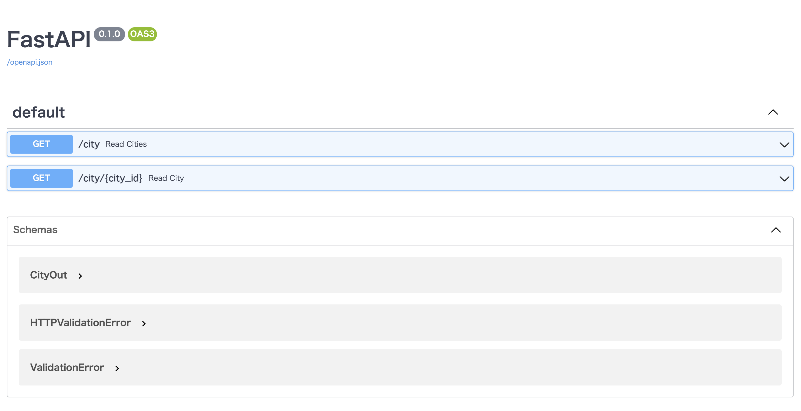

# Python のシンプルな Web フレームワーク「FastAPI」の触りだけ触れてみる

最近思うところがあって Python の勉強を始めました。  
でも機械学習はあまり興味がないし、とっつきやすい Web フレームワークでできるだけシンプルなやつないかなーと探したところ、ひっかかったのがこの FastAPI でした。  
というわけで、FastAPI を使ってウェブリクエスト経由で DB のレコードを取得するところまでやってみたいと思います。

## 環境構築

まずは環境を作りましょう。  
ローカル汚したくないマンなのでとりあえず仮想環境で作りましょう。  
まずは Dockerfile から。

```dockerfile:docker/app/dockerfile
FROM python:3.9.7-alpine

RUN apk update \
  && apk add build-base mariadb-dev libressl-dev musl-dev libffi-dev \
  && pip install autopep8 fastapi uvicorn[standard] pymysql mysqlclient cryptography

EXPOSE 8000
```

続いて Docker Compose の設定に移りましょう。

```yaml:docker/docker-compose.yml
services:
  app:
    build: ./app
    volumes:
      - ../src:/usr/app
    ports:
      - "8000:8000"
    tty: true
  database:
    # 下記URLから world データベースの SQL を取得して docker/database に格納する
    # https://dev.mysql.com/doc/index-other.html
    image: mysql:8.0.26
    volumes:
      - ./database:/docker-entrypoint-initdb.d
    restart: always
    ports:
      - "3306:3306"
    environment:
      MYSQL_ROOT_PASSWORD: password
```

シンプルな AP サーバーと DB サーバーの構成ですね。  
とりあえずお試しで動かす分には十分でしょう。

### Uvicorn とは

さて、今回導入した`Uvicorn`とは ASGI サーバーの一つらしいですが、こちらはちょっと耳慣れない単語です (いわゆる Pythonista には聞き慣れた単語かもしれません)。  
利用する前にサクッと調べておきましょう。

> ASGI (Asynchronous Server Gateway Interface) is a spiritual successor to WSGI, intended to provide a standard interface between async-capable Python web servers, frameworks, and applications.

> (Google 翻訳) ASGI（Asynchronous Server Gateway Interface）は、WSGI の精神的な後継者であり、非同期対応の Python Web サーバー、フレームワーク、およびアプリケーション間の標準インターフェイスを提供することを目的としています。

出典: [ASGI Documentation](https://asgi.readthedocs.io/en/latest/)

なるほど、元となる`WSGI`というものがあり、その後継となる立ち位置を自負しているんですね。  
おおよそのことは上記でわかりましたが、一応 WSGI についても簡単に調べておきましょう。

> This document specifies a proposed standard interface between web servers and Python web applications or frameworks, to promote web application portability across a variety of web servers.

> (Google 翻訳) このドキュメントでは、さまざまな Web サーバー間で Web アプリケーションの移植性を促進するために、Web サーバーと PythonWeb アプリケーションまたはフレームワークの間で提案されている標準インターフェイスを指定します。

出典: [PEP 3333 -- Python Web Server Gateway Interface v1.0.1](https://www.python.org/dev/peps/pep-3333/)

WSGI とは Python の Web アプリ(フレームワーク)のインターフェースを定義したもののようです。あくまで定義なんですね。  
つまりまとめると、Python の Web アプリでは WSGI というインターフェースが定義されており、それをより発展させた ASGI というインターフェース定義が存在し、さらにその実装として Uvicorn が存在する、ということでしょうか。  
ものすごく乱暴に言うと、Java でいう Tomcat みたいな存在でしょうか?

ともあれ、これで Uvicorn の立ち位置についてはおおよそわかったかと思います。

## 実装

と言うわけで実際にコードを書いてみましょう。  
今回は MySQL のサンプルデータを利用し、city テーブルのデータを取得できることを目標とします。  
[公式のチュートリアル](https://fastapi.tiangolo.com/ja/tutorial/)が簡単にまとめられているので、そちらを参考にするといいでしょう。

そして出来上がったものがこちらになります。

```python:src/main.py
from typing import List
from fastapi import FastAPI
from pydantic import BaseModel

from database import Database
from model import City

app = FastAPI()
db = Database()


class CityOut(BaseModel):
    id: int
    name: str
    country_code: str
    district: str
    population: int

    @classmethod
    def fromCities(cls, cities: List[City]) -> str:
        return [cls.fromCity(city) for city in cities]

    @staticmethod
    def fromCity(city: City) -> str:
        return {"id": city.id, "name": city.name, "country_code": city.country_code, "district": city.district, "population": city.population}


@app.get("/city", response_model=List[CityOut])
def read_cities(limit: int = 10):
    cities = db.read_cities(limit)
    return CityOut.fromCities(cities)


@app.get("/city/{city_id}", response_model=CityOut)
def read_city(city_id: int):
    city = db.read_city(city_id)
    return CityOut.fromCity(city)
```

上記の`main.py`以外にも`model.py`と`database.py`を作成しましたが、今回はあまり関係ないので載せていないです。  
[GitHub のリポジトリ](https://github.com/igm50/fastapi-sample)に載せてあるので、必要な方はそちらをどうぞ。

本題のコードを見てみますと、実にシンプルに作成できていることがわかります。  
大事なところを見ていきましょう。

```python
@app.get("/city", response_model=List[CityOut])
def read_cities(limit: int = 10):
    cities = db.read_cities(limit)
    return CityOut.fromCities(cities)
```

こちらは city の一覧を取得するエンドポイントですね。  
`@app.get`で HTTP メソッド、URL、レスポンスのデータ構造を定義しています。いちいち説明しなくてもよくある形なのでパッとわかるかと思います。  
引数の`limit`はクエリパラメータとして取得可能です。デフォルト値も設定可能で、今回は`10`としています。

```python
@app.get("/city/{city_id}", response_model=CityOut)
def read_city(city_id: int):
    city = db.read_city(city_id)
    return CityOut.fromCity(city)
```

こちらは指定した ID を持つ city を取得するエンドポイントです。  
今度の引数`city_id`は URL から取得しています。こちらもよくある形ですね。

## 起動

コードが書けたので今度は動かしてみましょう。  
Uvicorn にアプリを載せる形で起動します。

```terminal
$ uvicorn main:app --reload
```

正常に動作すれば OK です。

### API ドキュメント

さて、ここでお伝えしたいのが FastAPI の標準機能の一つである API ドキュメントの自動生成です。  
通常 FastAPI は 8000 ポートで起動されます (仮想環境上で動かしているので関係ないと言えば関係ないのですが)。  
`http://localhost:8000/docs`にアクセスしてみましょう。

<!--  -->


出ました。  
もはや Swagger は REST-API 開発のデファクトスタンダードと言っても過言ではないかと思いますが、FastAPI は Swagger UI のページをデフォルトで生成&提供してくれます。  
Swagger UI が提供されているのであれば、エンドポイントやリクエスト、レスポンスの形式を容易に確認できるほか、ブラウザ上でリクエストを送信して試すこともできます。  
このリクエスト、レスポンス形式はコード上で定義されているため、コードを更新するたびに最新化されます。  
ドキュメントの管理は重要であると同時に面倒なものでもありますが、フレームワーク側で全部やってくれるのであればそのメリットだけ享受することができます。  
本機能が開発速度の向上に大きく貢献するのは想像に難くないですね。

このように、FastAPI は軽量なフレームワークというだけでなく、モダンな機能も備えています。  
まだ触りだけしか触れられていないので、もっと使い込めばいろいろと便利な機能が見つかりそうでワクワクしますね。

## 終わりに

というわけで、FastAPI はすごいなぁという記事でした。  
フレームワークはそう簡単に乗り換えるというわけにはいきませんが、こういう便利なツールはどんどん使っていきたいですね。

## 参考

[FastAPI](https://fastapi.tiangolo.com/ja/)  
[Git のコミットメッセージの書き方](https://qiita.com/itosho/items/9565c6ad2ffc24c09364)  
[Python クラスについて](https://qiita.com/motoki1990/items/376fc1d1f3d59c960f5c)  
[Python 配列のループ処理](https://qiita.com/motoki1990/items/d06fc7559546a8471392)  
[Multiple variables in a 'with' statement?](https://stackoverflow.com/questions/893333/multiple-variables-in-a-with-statement)  
[Cannot "pip install cryptography" in Docker Alpine Linux 3.3 with OpenSSL 1.0.2g and Python 2.7](https://stackoverflow.com/questions/35736598/cannot-pip-install-cryptography-in-docker-alpine-linux-3-3-with-openssl-1-0-2g)  
[Alpine Linux で pip install mysqlclient するのにハマった時のメモ](https://qiita.com/itsu_dev/items/a17b515fdfa92ca912f1)
